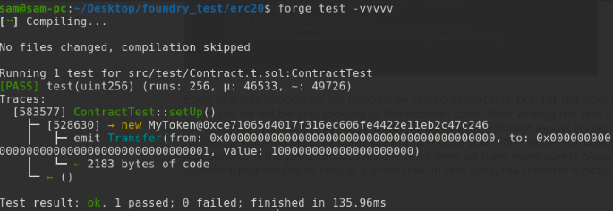

### Introduction
Property-based testing is described as a testing philosophy which targets all types of testing including unit, acceptance & integration testing. It was mainly standardized and properly introduced by [QuickCheck](https://hackage.haskell.org/package/QuickCheck), a Haskel based framework.
This testing methodology is now widely adapted & is being used by developers to bulletproof their code for greater reliability & resilience. That means ready for production, fearlessly!

### What exactly is Property-based testing ?
It can be defined as “An extracted statement or property of the code, program or a function to be tested in a way that the property or the statement always holds true”. In this type of testing, multiple different inputs are tested against a piece of code or a function in order to invalidate, fail or break the code flow. This is especially useful in identifying the missed edge-cases in the system.

Writing unit tests, covers a single aspect of code (i.e certain functionality works) whereas property-based testing focuses more on the outputs based on many different inputs provided to the code that needs to be tested. This by no means undermines the importance of writing unit tests.

Properties identified from system analysis are tested to check if they hold. one of the method for testing or falsifying the properties is called fuzzing. Where the fuzzer uses random seeds to prepare for initial calldata for breaking the properties. If the fuzzer has not found the calldata for breaking the property we can checkmar the contract safe enough but can't assure compelete security guarantees since the fuzzer runs in somewhat radomized manner which might completely miss the sequence for breaking the property.

### Brief Introduction of smart contracts 
Smart contracts are programs (aka, contracts) written in solidity language which are deployed on the ethereum blockchain or any EVM-based chains. Smart contracts contain a number of functions which can be called by users making a transaction (i.e calling a function on that contract) to the blockchain.

These contracts compile down to bytecode (i.e machine readable format) & are executed in the ethereum virtual machine (EVM). EVM executes as a stack machine which holds the rules for transitioning ethereum blockchain state from block to block. An example of a transaction can be the transfer of tokens from one address to another or transfer of the ownership of the contract to an address. 

### Importance of smart contract Testing
Testing the contract for its robustness & reliability are key factors in making the contract secure & bulletproof. One of the main reasons it is important is that these contracts will store or at the very least interact with the protocols that hold millions of dollars of money.

Once the smart contract is deployed it becomes public over the network & anyone can interact with it meaning opening doors to hackers & malicious users. Untested & unaudited code can lead to huge loss for the protocol & for the users using it. 

Most developers actively participate in writing the unit tests carefully for a contract or a codebase containing multiple contracts to make sure the functionality or function works as expected. A common testing strategy is scenario testing where after testing individual functions, multiple scenarios are created & tested with varying number of inputs. Though this provides guarantee against individual working components. But, is it enough ? As these cases are identified manually & tested leaving chances for explored edge-cases.

Property-based testing in smart contracts
The most important property of smart contract based blockchain systems is the financial application composability which we normally call as DeFi applications or protocols. More complex integration with these protocols blur or hide the edge cases & bugs that result in failure, loss of funds or malfunctioning of the application. 

Applying property-based testing helps in locating & identifying the edge cases & faulty assumptions that have been missed out during the unit & scenario based testing. Property-based testing is done on the smart contracts by identifying the properties & asserting if the invariant for a specific piece of code holds. 

```js
pragma solidity 0.8.10;
import "@openzeppelin/contracts/token/ERC20/ERC20.sol";

contract MyToken is ERC20 {
    constructor() ERC20("MyToken", "MTK") {
        _mint(msg.sender, 1_000_000 * 1e18);
    }
}
```
Based on the code sample above we can deduce the following properties. We will assume the contract cannot mint other than deployment and the contract doesn't hold the burn function.
1. `from` & `to` addresses cannot be the zero address while the transfer is made.
2. If `from` address transfers the tokens the tokens should be deducted from his balance.
3. The `from` address should have at least the number of tokens which are being sent. 
4. If `to` address receives the tokens the tokens should be added to his balance.
5. The total supply of the token remains unchanged.
6. Balances after the trade are properly adjusted.

For property-based testing we have multiple options to go with.
1. We can use a tool developed by [trailOfBits](https://www.trailofbits.com/) called [Echidna](https://github.com/crytic/echidna) which is a smart contract property-based testing framework.
2. [Foundry](https://book.getfoundry.sh/) developed by [Paradigm](https://www.paradigm.xyz/) heavily inspired by [dapptools](https://dapp.tools/). We are using foundry in this case.

```js
pragma solidity 0.8.10;

import "ds-test/test.sol";
import "../Contract.sol";

interface Vm {
    function prank(address) external;
    function assume(bool) external;
}

contract ContractTest is DSTest {
    Vm vm = Vm(0x7109709ECfa91a80626fF3989D68f67F5b1DD12D);
    MyToken token;
    address sender = address(1);
    address recipient = address(2);
    function setUp() public {
        token = new MyToken();
    }

    function test(uint256 amount) public {
        vm.assume(amount <= 100e18);
        uint256 from_balance = token.balanceOf(sender);
        uint256 recipient_balance = token.balanceOf(recipient);
        vm.prank(sender);
        token.transfer(recipient, amount);
        assertEq(token.balanceOf(sender), from_balance - amount);
        assertEq(token.balanceOf(recipient), recipient_balance + amount);
    }
}
```
Each of these properties will need to be tested separately. But, for the sake of simplicity we will be only looking at the transfer case. After writing the test case the program will run the function multiple times with different inputs trying ranges of values & likely to come up with the case you didn’t expect or assumed was correct. If the program passes the tests then we have more surety about a specific functionality to robust & error free, in this case, the transfer function. 



As we can see the program ran multiple inputs & the test we wrote passed without any error. This was a very basic example of property-based testing through foundry. I intend to create a separate tutorial on using both foundry & echidna for smart contract fuzzing soon so stay tuned!

### Bonus: Symbolic execution
Since we are talking about parameterization, one more thing I would briefly like to touch is symbolic execution. It weighs higher when compared with `unit testing` & `fuzzing`. 
Symbolic execution is a way to brute-force a program to find multiple different paths of program execution. This is useful in a sense that identifies exactly what inputs cas failure or stop the execution & what inputs actually cause the program to continue. It is important in terms of security as it outlines what undesired states the contract can get into.

[Here is the link for the github repo](https://github.com/abdulsamijay/foundry-fuzzing-basic-erc20) if you want to need a basic boilerplate.


### Wrap up!
That's all for now, I do plan to write an advanced tutorial using these tools i.e symbolic execution, fuzzing & formal verification in the future. So, stay tuned!